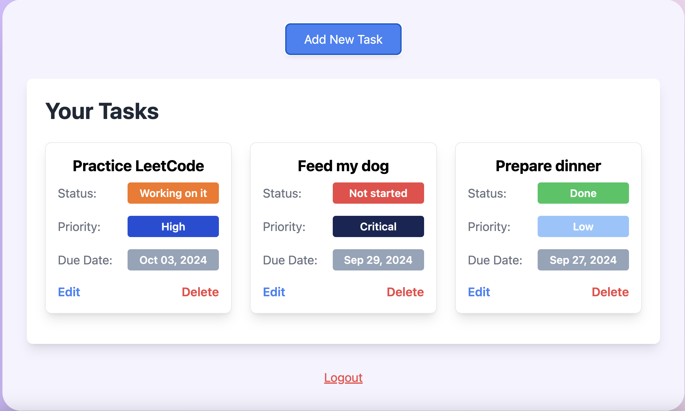

# Task Manager Project

This project is a simple Task Manager application designed to showcase backend development skills. The backend is built with Node.js, Express, PostgreSQL, and Prisma ORM. The project includes user authentication, CRUD operations for tasks, and JWT-based authorization. The frontend, which is built with React, was generated using ChatGPT. 
This project is deployed on [Railway](https://railway.app/).
## Live Demo
⮕[https://task-manager-production-14b8.up.railway.app/](https://task-manager-production-14b8.up.railway.app/)

## Tech Stack

- **Backend**: Node.js, Express, Prisma
- **Database**: PostgreSQL
- **Authentication**: JWT
- **Frontend**: AI-generated React for demonstration purposes
- **Deployment**: Railway
## Features

- User authentication (signup and login)
- JWT-based authorization
- CRUD operations for tasks
## Endpoints

### Users

- **POST** `/users/signup`: Create a new user
- **POST** `/users/login`: Login and receive a JWT token
- **POST** `/users/demo`: Login as a demo user, for the quick 

### Tasks

- **POST** `/tasks`: Create a new task 
- **GET** `/tasks`: Get all tasks for the authenticated user
- **DELETE** `/tasks/id`: Delete a task by id
- **PUT** `/tasks/id`: Modify a task by id